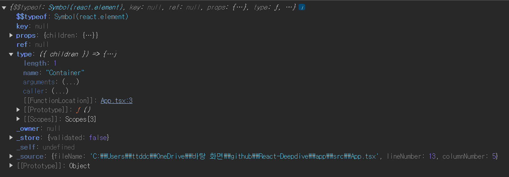

# `JSX` 를 이용해 함수들을 반환 할 때 반환되는 반환 값

---

우리는 이전 `docs` 에서 `React` 는 여러 컴포넌트들을

선언형 방식을 이용해 `Virtual DOM` 을 생성하여 웹에서 렌더링 되는 `Actual DOM` 을 조작한다는 사실을 알았다.

```tsx
  ...

const root = ReactDOM.createRoot(
  document.getElementById('root') as HTMLElement,
);
root.render(
  <React.StrictMode>
    <App />
  </React.StrictMode>,
);
```

`root.render` 는 `ReactDom.render()` 에 해당하는데 이는 `Virtual DOM` 에 해당하는 `ReactDom` 을 생성한다.

`root` 이하에 생성되는 `App` 컴포넌트를 살펴보면 다음과 같이 생겼다.

```tsx
const Container: React.FC<{ children: ReactNode }> = ({ children }) => {
  return <div>{children}</div>;
};

const Title: React.FC<{ text: string }> = ({ text }) => {
  return <h1>{text}</h1>;
};

function App() {
  return (
    <Container>
      <Title text='안녕하세요~!' />
    </Container>
  );
}
```

여러 함수형 컴포넌트들의 조합으로 이뤄진 `App` 컴포넌트가 호출되었을 때

어떤 일이 벌어지는지 살펴보자

```tsx
console.log(App());
```

`App` 함수가 호출될 때의 반환 값을 살펴보자



`App` 함수가 반환하는 객체 형태를 갖는 모습을 볼 수 있다.

우리는 다음처럼 함수들을 `JSX` 문법을 통해 반환하도록 했는데 말이다.

```tsx
function App() {
  return (
    <Container>
      <Title text='안녕하세요~!' />
    </Container>
  );
}
```

이는 `JSX` 를 이용해 `HTML` 과 유사한 문법으로 갖춘 코드들을

`Babel` 컴파일러가 리액트가 사용하는 자바스크립트 객체를 만드는 코드로 컴파일 해주기 때문이다.

# `React.createElement`

---

바벨 컴파일러가 `JSX` 파일을 컴파일 하여 리액트에서 사용하는 자바스크립트 객체인

엘리먼트를 생성하는 메소드로 컴파일 해준다.

```tsx
<Container>
  <Title text='Hello~!' />
</Container>
```

다음과 같이 생긴 `JSX` 파일을 `Babel` 이 컴파일 할 때는

```tsx
React.createElement(
  Container,
  null,
  React.createElement(Title, { text: 'Hello~!' }),
);
```

다음과 같이 생성한다.

그렇다면 `React.createElement` 메소드가 의미하는 것은 무엇일까 ?

공식문서에 정의된 `React.createElement` 의 설명은 다음과 같다.

```tsx
function createElement<P extends {}>(
  type: FunctionComponent<P> | ComponentClass<P> | string,
  props?: (Attributes & P) | null,
  ...children: ReactNode[]
): ReactElement<P>;
```

> `React.createElement` 는 `React.Element` 를 생성한다.
>
> - `type` : 유효한 `React` 컴포넌트를 받는다. 예를 들어 `HTMLElement` 태그 이름 문자열 또는 `React` 컴포넌트가 될 수 있다.
> - `props` : `props` 는 객체 또는 `null` 이여야 한다.
> - `children` : `children` 은 선택 사항이며 0개 이상의 자식 노드 , 엘리먼트 , 문자열 , 숫자 ... 등이 들어 올 수 있으며 `React` 노드 배열을 포함한 모든 `React` 노드가 될 수 있다.
>
> https://ko.react.dev/reference/react/createElement

아 ! `React.createElement` 는 `React.Element` 를 생성하고

`type` 에는 컴포넌트들 , `props` 엔 해당 컴포넌트에서 사용할 `Attributes` 객체가 들어오고

`children` 엔 리액트 노드들이 담긴 배열을 받는구나

# `React.Element`

---

그렇다면 `React.Element` 는 무엇일까 ?

```tsx
interface ReactElement<
  P = any,
  T extends string | JSXElementConstructor<any> =
    | string
    | JSXElementConstructor<any>,
> {
  type: T;
  props: P;
  key: string | null;
}
```

타입스크립트로 정의된 `React.Element` 는 다음과 같이 생겼다.

`React.createElement` 로 생성되는 `React.Element` 는 `type , children , props` 를 프로퍼티로 갖는 자바스크립트 객체이다.

`React.Element` 는 `children` 이란 프로퍼티를 통해 트리구조의 모습을 갖는다.

```tsx
<Container>
  <Title text='Hello~!' />
</Container>
```

해당 `JSX` 가 컴파일 되어 `React.createElement` 로 생성된 `React.Element` 객체는 다음과 같은 모습을 갖는다.

```tsx
React.createElement(
  Container,
  null,
  React.createElement(Title, { text: 'Hello~!' }),
);
```

```tsx
React.createElement(Title, { text: 'Hello~!' });
```

내부에 존재하는 `React.createElement (Title , ..)` 는

다음과 같은 자바스크립트 객체를 생성한다.

```tsx
{
  "type": Title,
  "props": {
    "text": "Hello~!",
    "children": null
  },
  "key": null,
  "ref": null
}
```

자바스크립트 객체로 변환 이후

외부에 존재하는 `React.createElement(Container , ..)` 는 다음과 같이 변경된다.

```tsx
React.createElement(Container, null, {
  type: Title,
  props: {
    text: 'Hello~!',
    children: null,
  },
  key: null,
  ref: null,
});
```

최종적으로 생성되는 `React.Element` 는 다음과 같이 생겼다.

```tsx
{
  "type": Container,
  "props": {
    "children": {
      "type": Title,
      "props": {
        "text": "Hello~!",
        "children": null
      },
      "key": null,
      "ref": null
    }
  },
  "key": null,
  "ref": null
}
```

`Actual DOM` 을 생성하는 동작에 비해

재귀적으로 `React.createElement` 를 호출하여 `React.Element` 를 생성하는 과정은

`Actual DOM` 과 유사한 구조의 트리 자료구조 객체를 생성하지만

`paint , layout` 을 거치지 않고 메모리 상의 객체를 생성하는 것이기 때문에

비용이 매우 저렴하다는 점을 기억하자

### `React.Element` 가 그러면 `Virtual DOM` 의 노드가 되는걸까 ?

---

`React.Element` 는 단순히 `UI` 에 렌더링 하기 위한 컴포넌트의

**모습을 선언해둔 것이다.**

`React` 는 `React.Element` 로 생성된 자바스크립트 객체를 활용하여

`Virtual DOM` 을 구성하는 것은 맞지만

`Virtual DOM` 을 구성 할 때 각 컴포넌트들의 `state , lifeCycle` 등을 고려하여

노드를 생성한다.

# 정리

---

`JSX` 문법을 통해 정의한 컴포넌트들은 호출 될 때

`React.createElement(..)` 로 변환되고

재귀적인 `React.createElement` 호출을 통해 최종적인 자바스크립트 객체인

`React.Element` 를 반환한다.

생성된 `React.Element` 들은 `React.DOM` 에서 생성할 `Virtual DOM` 이 렌더링 할 모습을

정의해둔 자료구조이며

`React` 는 이렇게 생성된 `React.Element` 에 `state , lifeCycle` 등을 고려하여

`Virtual DOM` 의 노드를 생성한다.
