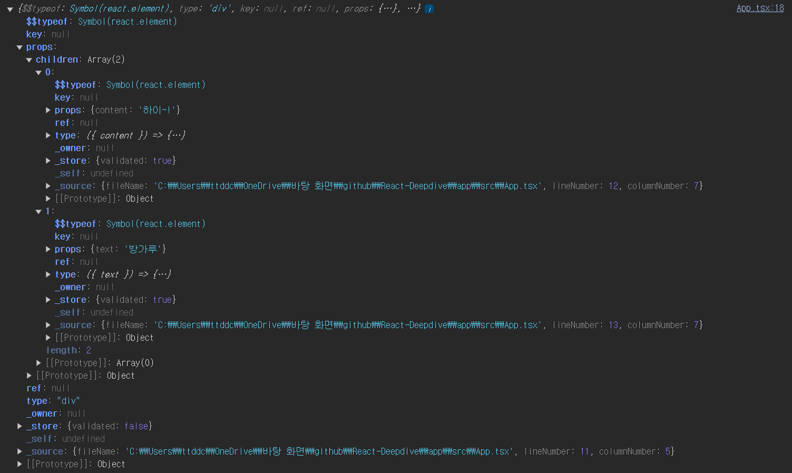

# `ReactElement Recap`

---

이전 `docs` 에서 리액트에서 `JSX` 는 `Babel` 을 통해

`createElement` 메소드로 변경해 `ReactElement` 를 생성한다는 것을 배웠다.

이렇게 생성된 `ReactElement` 들은 `type ,key , props` 등에 대한 정보를 담고 있다.

#### `react/src/jsx/ReactJSXElement`

```jsx
function ReactElement(type, key, _ref, self, source, owner, props) {
  let ref;
  if (enableRefAsProp) {
    const refProp = props.ref;
    ref = refProp !== undefined ? refProp : null;
  } else {
    ref = _ref;
  }

    //  ... 여러 부분 생략
  element = {
      $$typeof: REACT_ELEMENT_TYPE, // Symbol 객체
      type,
      key,
      ref,
      props,
    };
  }

  return element;
}
```

`ReactElement` 에서 `$$typeof` 에 들어가는 `REACT_ELEMENT_TYPE` 심볼 객체는 다음과 같이 정의되어 있다.

#### `shared/ReactSymbol`

```jsx
...
export const REACT_LEGACY_ELEMENT_TYPE: symbol = Symbol.for('react.element');
export const REACT_ELEMENT_TYPE: symbol = renameElementSymbol
  ? Symbol.for('react.transitional.element')
  : REACT_LEGACY_ELEMENT_TYPE;
...
```

#### `shared/ReactFlags`

```jsx
...
// Renames the internal symbol for elements since they have changed signature/constructor
export const renameElementSymbol = true;
...
```

실제로도 그런지 확인해보자

```jsx
const FirstComponent = ({ content }: { content: string }) => {
  return <h1>{content}</h1>;
};

const SecondComponent = ({ text }: { text: string }) => {
  return <h2>{text}</h2>;
};

const App = () => {
  return (
    <div>
      <FirstComponent content='하이~!' />
      <SecondComponent text='방가루' />
    </div>
  );
};

console.log(App());

export default App;
```



흠 .. `typeof` 는 `Symbol(react.element)` 이다. 기존 코드에선 `Symbol.for('react.transitional.element')` 이 값이 될줄 알았는데

빌드 될 떄의 설정값이 다른지 `Symbol(react.element)` 로 나온다. 뭐 어쨌든 ~!

# 간략하게 살펴보는 `Virtaul DOM`

---


리액트를 배우기 시작하면 중요한듯 다뤄지는 이야기가 아마 `Virtual DOM` 일 것이다.

리액트는 `Actual DOM` 의 모습과 동기화되는 자바스크립트 객체인 `Virtual DOM` 을 생성하며

해당 `Virtual DOm` 을 `current Tree` 혹은 **`current`** 라고 한다.

`Virtual DOM` 의 모습은 `JSX-> ReactElement` 로 생성되는 트리의 구조와 유사하다.

> 유사하다고 한 이유는 트리의 구조는 같지만 내부 `Node` 들은 `ReactElement` 로 이뤄져있지 않기 때문이다.

이 때 만약 컴포넌트의 상태가 변경되거나 렌더링 하기 위해 받는 값이 변경되어 컴포넌트의 변경이 일어나게 된다면

리액트는 `current Tree` 객체를 복사한 **`WorkinProgress Tree`** 를 생성하고

생성된 `WorkinProgress Tree` 를 순회하며 업데이트 될 내용을 확인하며 업데이트가 필요한 노드는 업데이트하여 새로운 노드로 생성한다.

순회가 종료되어 `current` 에서 업데이트가 된 `WorkinProgress Tree` 를 `current Tree` 로 지정하며

(여기까지가 `render phase` , 이후는 `commit phase`)

새롭게 변경된 `current Tree` 에서 변경된 사항을 `Actual DOM` 에 적용시킨다.

> ### 용어 정리
>
> - `current  , WorkinProgress` 와 같이 두 가지의 `Virtual DOM` 을 이용하는 이런 시스템을 `double buffer` 라고 한다.

# `Virtual DOM` 의 `Node` 는 그럼 무엇일까 ?

---

위에서 리액트는 `JSX` 를 통해 `ReactElement` 를 만들고 트리구조인

`Virtual DOM` 인 `current Tree` 를 생성한다고 하였다.

그럼 문득 궁금해진다. `current Tree` 혹은 `WorkinProgress Tree` 들의 `Node` 는 어떻게 생겼을까 ?

`ReactElement` 일까 ?

그렇지 않다.

```tsx
/* reactElement 의 예시 */
{
  "type": Container,
  "props": {
    "children": {
      "type": Title,
      "props": {
        "text": "Hello~!",
        "children": null
      },
      "key": null,
      "ref": null
    }
  },
  "key": null,
  "ref": null
}
```

리액트에 존재하는 다양한 컴포넌트의 종류들을 담기에는 `ReactElement.$$typeof` 는 고작 심볼 객체 하나뿐이고

컴포넌트 내부에 정의된 `state` 와 같은 상태값을 저장하는 프로퍼티도 존재하지 않는다.

이에 리액트는 복잡한 정보들을 담기 위해 `ReactElement` 를 이용해 **`Fiber`** 라는 객체를 만들어 사용한다.

즉 , `Virtual DOM` 의 `node` 는 `Fiber` 이다.

# `Fiber Node` 를 만들기 위한 여정

---

> # `react-reconciler/src/ReactFiber.js`

---

#### `createFibberFromElement`

```tsx
export function createFiberFromElement(
  element: ReactElement,
  mode: TypeOfMode,
  lanes: Lanes,
): Fiber {
  let owner = null;
  /* 개발시 사용되는 DEV 코드는 생략 */
  const type = element.type;
  const key = element.key;
  const pendingProps = element.props;
  const fiber = createFiberFromTypeAndProps(
    type,
    key,
    pendingProps,
    owner,
    mode,
    lanes,
  );
  return fiber;
}
```

`reconiler` 패키지를 살펴보면 다음과 같이 `ReactElement` 를 받아 `Fiber` 를 생성하는 함수를 볼 수 있다.

`ReactElement` 내부에 존재하는 `type , key , pendingProps` 를 받은 후

`createFiberFromTypeAndProps` 함수를 이용해 `Fiber` 객체를 생성후 반환한다.

아직 `Fiber` 가 뭔지 `createFiberFromTypeAndProps` 뭔지는 모르지만

`ReactElement` 가 `Fiber` 객체로 변경되는 모습은 볼 수 있다.

#### `createFiberFromTypeAndProps`

```tsx
export function createFiberFromTypeAndProps(
  type: any, // React$ElementType
  key: null | string,
  pendingProps: any,
  owner: null | ReactComponentInfo | Fiber,
  mode: TypeOfMode,
  lanes: Lanes,
): Fiber {
  let fiberTag = FunctionComponent;
  // The resolved type is set if we know what the final type will be. I.e. it's not lazy.
  let resolvedType = type;
  if (typeof type === 'function') {
    if (shouldConstruct(type)) {
      fiberTag = ClassComponent;
    }
  } else if (typeof type === 'string') {
    if (supportsResources && supportsSingletons) {
      const hostContext = getHostContext();
      fiberTag = isHostHoistableType(type, pendingProps, hostContext)
        ? HostHoistable
        : isHostSingletonType(type)
        ? HostSingleton
        : HostComponent;
    } else if (supportsResources) {
      const hostContext = getHostContext();
      fiberTag = isHostHoistableType(type, pendingProps, hostContext)
        ? HostHoistable
        : HostComponent;
    } else if (supportsSingletons) {
      fiberTag = isHostSingletonType(type) ? HostSingleton : HostComponent;
    } else {
      fiberTag = HostComponent;
    }
  } else {
    getTag: switch (type) {
      case REACT_FRAGMENT_TYPE:
        return createFiberFromFragment(pendingProps.children, mode, lanes, key);
      case REACT_STRICT_MODE_TYPE:
        fiberTag = Mode;
        mode |= StrictLegacyMode;
        if (disableLegacyMode || (mode & ConcurrentMode) !== NoMode) {
          // Strict effects should never run on legacy roots
          mode |= StrictEffectsMode;
          if (
            enableDO_NOT_USE_disableStrictPassiveEffect &&
            pendingProps.DO_NOT_USE_disableStrictPassiveEffect
          ) {
            mode |= NoStrictPassiveEffectsMode;
          }
        }
        break;
      case REACT_PROFILER_TYPE:
        return createFiberFromProfiler(pendingProps, mode, lanes, key);
      case REACT_SUSPENSE_TYPE:
        return createFiberFromSuspense(pendingProps, mode, lanes, key);
      case REACT_SUSPENSE_LIST_TYPE:
        return createFiberFromSuspenseList(pendingProps, mode, lanes, key);
      case REACT_OFFSCREEN_TYPE:
        return createFiberFromOffscreen(pendingProps, mode, lanes, key);
      case REACT_LEGACY_HIDDEN_TYPE:
        if (enableLegacyHidden) {
          return createFiberFromLegacyHidden(pendingProps, mode, lanes, key);
        }
      // Fall through
      case REACT_SCOPE_TYPE:
        if (enableScopeAPI) {
          return createFiberFromScope(type, pendingProps, mode, lanes, key);
        }
      // Fall through
      case REACT_TRACING_MARKER_TYPE:
        if (enableTransitionTracing) {
          return createFiberFromTracingMarker(pendingProps, mode, lanes, key);
        }
      // Fall through
      case REACT_DEBUG_TRACING_MODE_TYPE:
        if (enableDebugTracing) {
          fiberTag = Mode;
          mode |= DebugTracingMode;
          break;
        }
      // Fall through
      default: {
        if (typeof type === 'object' && type !== null) {
          switch (type.$$typeof) {
            case REACT_PROVIDER_TYPE:
              if (!enableRenderableContext) {
                fiberTag = ContextProvider;
                break getTag;
              }
            // Fall through
            case REACT_CONTEXT_TYPE:
              if (enableRenderableContext) {
                fiberTag = ContextProvider;
                break getTag;
              } else {
                fiberTag = ContextConsumer;
                break getTag;
              }
            case REACT_CONSUMER_TYPE:
              if (enableRenderableContext) {
                fiberTag = ContextConsumer;
                break getTag;
              }
            // Fall through
            case REACT_FORWARD_REF_TYPE:
              fiberTag = ForwardRef;
              if (__DEV__) {
                resolvedType = resolveForwardRefForHotReloading(resolvedType);
              }
              break getTag;
            case REACT_MEMO_TYPE:
              fiberTag = MemoComponent;
              break getTag;
            case REACT_LAZY_TYPE:
              fiberTag = LazyComponent;
              resolvedType = null;
              break getTag;
          }
        }
        let info = '';

        throw new Error(
          'Element type is invalid: expected a string (for built-in ' +
            'components) or a class/function (for composite components) ' +
            `but got: ${type == null ? type : typeof type}.${info}`,
        );
      }
    }
  }

  const fiber = createFiber(fiberTag, pendingProps, key, mode);
  fiber.elementType = type;
  fiber.type = resolvedType;
  fiber.lanes = lanes;


  return fiber;
```

해당 함수를 보면 매우 길고 복잡해보이지만 중요한 점만 찝어서 살펴보자

코드 초반에 존재하는 로직들은 모두 `fiberTag` 를 구하기 위한 로직들이다.

> 리액트에서 사용하는 `fiberTag` 들은 글 하단에 첨부하도록 한다.

만약 `type` 이 문자일 경우 (`div , h1 , span .. etc`) 엔 내부 다양한 함수 로직을 통해 `HostComponent` 태그를 갖게 되고

함수일 경우엔 `FunctionComponent` 등의 값이 태그로 부착된다.

이후 만약 `tag` 가 필요 없는 경우엔 `tag` 없이 `Fiber` 노드를 생성하여 반환하고

`tag` 가 필요한 경우 코드 마지막 부분에 존재하는

```tsx
export function createFiberFromTypeAndProps(
  type: any, // React$ElementType
  key: null | string,
  pendingProps: any,
  owner: null | ReactComponentInfo | Fiber,
  mode: TypeOfMode,
  lanes: Lanes,
): Fiber {
  ...
  const fiber = createFiber(fiberTag, pendingProps, key, mode);
  fiber.elementType = type;
  fiber.type = resolvedType;
  fiber.lanes = lanes;


  return fiber;
}
```

와 같이 `fiberTag` 를 이용해 `createFiber` 함수를 실행하고 생성된 `fiber` 객체를 반환한다.

> ### 정리
>
> 내용이 너무 복잡하기 때문에 정리하자
> `Virtual DOM` 의 `node` 가 되는 `Fiber` 는 `createFiberFromElement` 를 통해 생성된다.
> 이 때 `Element.type` 에 따라 다양한 `fiberTag` 가 생성되고
> `fiberTag` 를 인수로 받는 `createFiber` 함수를 실행하여 `fiber` 객체를 반환한다.

#### `createFiber`

```tsx
function createFiber(
  tag: WorkTag,
  pendingProps: mixed,
  key: null | string,
  mode: TypeOfMode,
): Fiber {
  // $FlowFixMe[invalid-constructor]: the shapes are exact here but Flow doesn't like constructors
  return new FiberNode(tag, pendingProps, key, mode);
}
```

`createFiber` 는 단순이 인수들을 받아 `new FiberNode` 를 이용해 `fiber` 객체를 생성하여 반환한다.

그럼 반환하는 `fiber` 가 어떻게 생겼는지만 안다면 우리는 `Virtual DOM` 의 `node` 가 어떻게 생겼는지를 알 수 있다.

# ⭐ `FiberNode` 드디어 발견

```tsx
function FiberNode(
  this: $FlowFixMe,
  tag: WorkTag,
  pendingProps: mixed,
  key: null | string,
  mode: TypeOfMode,
) {
  // Instance
  this.tag = tag; /* ReactFiberFlags 의 Tag 가 부착 */
  this.key = key;
  this.elementType = null;
  this.type = null;
  this.stateNode = null;

  // Fiber
  this.return = null;
  this.child = null;
  this.sibling = null;
  this.index = 0;

  this.ref = null;
  this.refCleanup = null;

  this.pendingProps = pendingProps;
  this.memoizedProps = null;
  this.updateQueue = null;
  this.memoizedState = null;
  this.dependencies = null;

  this.mode = mode;

  // Effects
  this.flags = NoFlags;
  this.subtreeFlags = NoFlags;
  this.deletions = null;

  this.lanes = NoLanes;
  this.childLanes = NoLanes;

  this.alternate = null;

  if (enableProfilerTimer) {
    // Note: The following is done to avoid a v8 performance cliff.
    //
    // Initializing the fields below to smis and later updating them with
    // double values will cause Fibers to end up having separate shapes.
    // This behavior/bug has something to do with Object.preventExtension().
    // Fortunately this only impacts DEV builds.
    // Unfortunately it makes React unusably slow for some applications.
    // To work around this, initialize the fields below with doubles.
    //
    // Learn more about this here:
    // https://github.com/facebook/react/issues/14365
    // https://bugs.chromium.org/p/v8/issues/detail?id=8538
    this.actualDuration = Number.NaN;
    this.actualStartTime = Number.NaN;
    this.selfBaseDuration = Number.NaN;
    this.treeBaseDuration = Number.NaN;

    // It's okay to replace the initial doubles with smis after initialization.
    // This won't trigger the performance cliff mentioned above,
    // and it simplifies other profiler code (including DevTools).
    this.actualDuration = 0;
    this.actualStartTime = -1;
    this.selfBaseDuration = 0;
    this.treeBaseDuration = 0;
  }
}
```

`Fiber` 노드를 보면 `ReactElement` 때와 다르게 수많은 프로퍼티들을 갖고 있는 것을 볼 수 있다.

몇 가지 값은 `ReactElement` 의 값을 그대로 받아 쓰거나 대부분 `Null` 값으로 선언되어 있는 모습을 볼 수 있다.

아무래도 초기 생성 이후 `Fiber` 들의 프로퍼티를 설정해주는 것은 다른 메소드들이 해주는듯 싶다.

다만 각 프로퍼티들이 갖는 의미들을 여러 블로그와 지피티를 통해 찾아와봤다.

## `Fiber` 의 다양한 프로퍼티들이 갖는 의미

### `Fiber / instance`

```tsx
this.tag = tag; /* ReactFiberFlags 의 Tag 가 부착 */
this.key = key;
this.elementType = null;
this.type = null;
this.stateNode = null;
```

해당 프로퍼티들은 `Fiber` 인스턴스가 가지고 있을 정보들을 의미한다.

대부분의 값들은 `ReactElement` 에서 전달 받은 값이 부착되며

`stateNode` 는 해당 `Fiber` 가 가리키는 실제 인스턴스인 `DOM` 또는 클래스형 컴포넌트의 인스턴스 , `null` 등의 값이 담긴다.

### `Fiber / Fiber `


```tsx
this.return = null; // 부모 노드
this.child = null; // 첫 번째 자식 노드
this.sibling = null; // 다음 형제 노드
this.index = 0; // 형제 노드들 사이에서의 위치

// 참조 관련 속성
this.ref = null; // ref 속성
this.refCleanup = null; // ref가 해제될 때 실행되는 정리 함수

// Props 및 State 관련 속성
this.pendingProps = pendingProps; // 최신의 아직 적용되지 않은 props
this.memoizedProps = null; // 이미 렌더링된 이전의 props
this.memoizedState = null; // 이미 렌더링된 이전의 state
this.updateQueue = null; // 업데이트가 대기 중인 작업들의 큐
this.dependencies = null; // 컨텍스트나 기타 의존성

// 기타 속성
this.mode = mode; // 현재 작동 모드
```

`return , child , sibling` 값은 해당 노드의 부모노드 , 자식노드 , 형제노드를 가리키는 포인터 값이다.

각 `Fiber` 들은 단방향 연결리스트 형태로 연결되어 있다.

이러한 단방향 연결리스트 형태는 `Virtual DOM` 을 순회할 때 빠르게 순회하는 것을 가능하게 한다.

이후 현재 `props` 를 담는 `pendingProps` 와 `memoized` 된 `props , state` 값을 담고 있는 `memoizedProps , memoizedState` 프로퍼티 와

`Fiber` 에서 실행되어야 할 작업들을 담는 `updateQueue` , 의존성이 담긴 `dependencies` 등이 존재한다.

#### `updateQueue`

`updateQueue` 는 연결 리스트 형태로 존재하며 만약 해당 `Fiber` 가 가리키는 `Component` 의 상태가 업데이트 되거나 재렌더링 되어야 한다면

`updateQueue` 에 연결리스트 형태로 추가된다.

#### `dependencies`

디펜던시는 해당 `Fiber` 와 의존성을 가지고 있는 값이 `Map` 형태로 저장되며

주로 해당 `Fiber` 가 구독하고 있는 `Context` (리렌더링을 야기하는 상태 값) 나

해당 `Fiber` 의 리렌더링을 트리거 하는 경우들이 저장되어 있다.

### `Fiber` 는 작업 단위이다 ?

```tsx
// Effects
this.flags = NoFlags;
this.subtreeFlags = NoFlags;
this.deletions = null;
```

`Fiber` 는 본인에게 일어날 업데이트 뿐 아니라 자식 노드들에서 일어날 작업들을 `flags , subtreeFlags` 에 저장한다.

`Effects` 라 표현되어 있는 것은 변경 이후 해당 `Fiber` 에 일어날 영향을 저장하는 것으로

결국 `Fiber` 들은 본인과 , 본인을 포함한 자식 노드들에게 일어날 작업들을 저장하고 있다.

#### 비트 연산자를 이용하여 작업 단위를 저장한다.

#### `react-reconciler/src/ReactFiberFlags.js`

```tsx
export type Flags = number;

// Don't change these values. They're used by React Dev Tools.
export const NoFlags = /*                      */ 0b0000000000000000000000000000;
export const PerformedWork = /*                */ 0b0000000000000000000000000001;
export const Placement = /*                    */ 0b0000000000000000000000000010;
export const DidCapture = /*                   */ 0b0000000000000000000010000000;
export const Hydrating = /*                    */ 0b0000000000000001000000000000;

// You can change the rest (and add more).
export const Update = /*                       */ 0b0000000000000000000000000100;
/* Skipped value:                                 0b0000000000000000000000001000; */

export const ChildDeletion = /*                */ 0b0000000000000000000000010000;
export const ContentReset = /*                 */ 0b0000000000000000000000100000;
export const Callback = /*                     */ 0b0000000000000000000001000000;
/* Used by DidCapture:                            0b0000000000000000000010000000; */

export const ForceClientRender = /*            */ 0b0000000000000000000100000000;
export const Ref = /*                          */ 0b0000000000000000001000000000;
export const Snapshot = /*                     */ 0b0000000000000000010000000000;
export const Passive = /*                      */ 0b0000000000000000100000000000;
/* Used by Hydrating:                             0b0000000000000001000000000000; */

export const Visibility = /*                   */ 0b0000000000000010000000000000;
export const StoreConsistency = /*             */ 0b0000000000000100000000000000;
...
```

`flag` 들은 다음과 같이 비트형태로 저장된 값을 이용한다.

그럼 의문이 든다. 왜 비트 형태로 저장할까 ?

`flag` 등을 추가하는 나중에 다룰 함수를 살펴보자

```tsx
function completeWork(current, workInProgress, renderLanes) {
  // 하위 노드의 작업을 마치고 현재 노드의 작업을 완료
  const newFlags = workInProgress.flags | workInProgress.subtreeFlags;

  // 부모 노드의 subtreeFlags에 현재 노드의 flags를 추가
  let parent = workInProgress.return;
  if (parent !== null) {
    parent.subtreeFlags |= newFlags;
  }
}
```

`|=` 연산자를 이용해 본인의 `flag` 뿐 아니라 부모 `Fiber` 의 `flag` 에도 플래그를 추가해주고 있는 모습을 볼 수 있다.

```tsx
if (flags & Placement) {
  console.log('Placement 플래그가 설정되어 있습니다.');
}

if (flags & Update) {
  console.log('Update 플래그가 설정되어 있습니다.');
}
```

플래그를 비트 연산자로 관리해주면 플래그에서 특정한 작업이 있는지를 아주 빠르게 확인 할 수 있으며

```tsx
flags &= ~Placement;
```

플래그들에서 어떤 플래그를 제거하는 것도 매우 빠르게 하는 것이 가능하다.

#### 그럼 `Flag` 들을 저장하고 있는 것이 어떤 도움이 되는데 ?

추후 나올 내용이지만 컴포넌트에 `re-render` 가 일어나 `Virtual DOM` 을 새로 생성 할 때

`Virtual DOM` 을 순회하며 업데이트가 일어날 노드의 `flag` 에 일어날 업데이트들을 추가하고

부모 노드의 `subtree flag` 에도 같은 업데이트들을 추가한다.

이렇게 설정된 `flag` 들은 추후 `commit phase` 에서 `actual dom` 에 변화를 줄 때

브라우저상에 렌더링 될 항목들을 결정하는 지표가 된다.

또 부모 노드에서 자식 노드들의 작업 단위를 `subtree flags` 로 관리함으로서

`Virtual DOM` 을 순회 할 때 순회하지 않아도 될 항목을 불필요하게 순회 할 필요가 없게 만든다.

---

# 부록

### `ReactFiberFlags`

### `ReactWorkTags`

`fiberTag` 는 다음과 같은 값들을 가질 수 있다.

```tsx
export type WorkTag =
  | 0
  | 1
  | 2
  | 3
  | 4
  | 5
  | 6
  | 7
  | 8
  | 9
  | 10
  | 11
  | 12
  | 13
  | 14
  | 15
  | 16
  | 17
  | 18
  | 19
  | 20
  | 21
  | 22
  | 23
  | 24
  | 25
  | 26
  | 27
  | 28;

export const FunctionComponent = 0;
export const ClassComponent = 1;
export const HostRoot = 3; // Root of a host tree. Could be nested inside another node.
export const HostPortal = 4; // A subtree. Could be an entry point to a different renderer.
export const HostComponent = 5;
export const HostText = 6;
export const Fragment = 7;
export const Mode = 8;
export const ContextConsumer = 9;
export const ContextProvider = 10;
export const ForwardRef = 11;
export const Profiler = 12;
export const SuspenseComponent = 13;
export const MemoComponent = 14;
export const SimpleMemoComponent = 15;
export const LazyComponent = 16;
export const IncompleteClassComponent = 17;
export const DehydratedFragment = 18;
export const SuspenseListComponent = 19;
export const ScopeComponent = 21;
export const OffscreenComponent = 22;
export const LegacyHiddenComponent = 23;
export const CacheComponent = 24;
export const TracingMarkerComponent = 25;
export const HostHoistable = 26;
export const HostSingleton = 27;
export const IncompleteFunctionComponent = 28;
```
